# Data Visualization using Python - Matplotlib and Seaborn

## Introduction

Data visualization is the graphic representation of data. It involves producing images that communicate relationships among the represented data to viewers. Visualizing data is an essential part of data analysis and machine learning. In this tutorial, we'll use Python libraries Matplotlib and Seaborn to learn and apply some popular data visualization techniques.

To begin let's import the libraries. We'll use the matplotlib.pyplot for basic plots like line & bar charts. It is often imported with the alias plt. The seaborn module will be used for more advanced plots, and it is imported with the alias sns.

```python
!pip install matplotlib seaborn --upgrade --quiet
```

```python
import matplotlib.pyplot as plt
```

```python
import seaborn as sns
```

```python
%matplotlib inline
```

Notice this we also include the special command %matplotlib inline to ensure that plots are shown and embedded within the Jupyter notebook itself. Without this command, sometimes plots may show up in pop-up windows.

## Line Chart

Line charts are one of the simplest and most widely used data visualization techniques. A line chart displays information as a series of data points or markers, connected by straight lines. You can customize the shape, size, color and other aesthetic elements of the markers and lines for better visual clarity.

Here's a Python list showing the yield of apples (tons per hectare) over 6 years in an imaginary country called Kanto.

```python
yield_apples = [0.895, 0.91, 0.919, 0.926, 0.929, 0.931]
```

We can visualize how the yield of apples changes over time using a line chart. To draw a line chart, we can use the plt.plot function.

```python
plt.plot(yield_apples)
```

    [<matplotlib.lines.Line2D at 0x1fe47d084f0>]

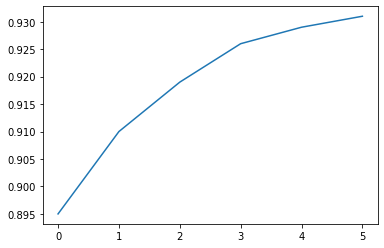

Calling the plt.plot function draws the line chart as expected, and also returns a list of plots drawn [<matplotlib.lines.Line2D at 0x7ff70aa20760>] shown within the output. We can include a semicolon (;) at the end of the last statement in the cell to avoiding showing the output and just display the graph.

```python
plt.plot(yield_apples);

```


## Customizing the X-axis

The X-axis of the plot currently shows list element indexes 0 to 5. The plot would be more informative if we could show the year for which the data is being plotted. We can do this by two arguments plt.plot.

```python
years = [2010, 2011, 2012, 2013, 2014, 2015]
yield_apples = [0.895, 0.91, 0.919, 0.926, 0.929, 0.931]
```

```python
plt.plot(years, yield_apples);
```

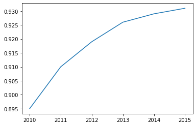

## Axis Labels

We can add labels to the axes to show what each axis represents using the plt.xlabel and plt.ylabel methods.

```python
plt.plot(years, yield_apples)
plt.xlabel('Year')
plt.ylabel('Yield (tons per hectare)');
```

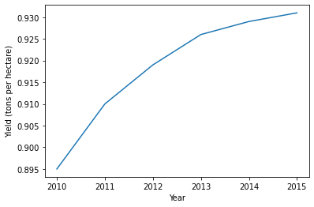


## Plotting Multiple Lines

It's really easy to plot multiple lines in the same graph. Just invoke the plt.plot function multiple times. Let's compare the yields of apples vs. oranges in Kanto.

```python
years = range(2000, 2012)
apples = [0.895, 0.91, 0.919, 0.926, 0.929, 0.931, 0.934, 0.936, 0.937, 0.9375, 0.9372, 0.939]
oranges = [0.962, 0.941, 0.930, 0.923, 0.918, 0.908, 0.907, 0.904, 0.901, 0.898, 0.9, 0.896, ]
```

```python
plt.plot(years, apples)
plt.plot(years, oranges)
plt.xlabel('Year')
plt.ylabel('Yield (tons per hectare)');
```

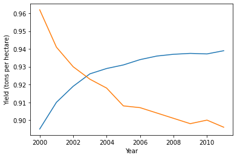


## Chart Title and Legend

To differentiate between multiple lines, we can include a legend within the graph using the plt.legend function. We also give the entire chart a title using the plt.title function

```python
plt.plot(years, apples)
plt.plot(years, oranges)

plt.xlabel('Year')
plt.ylabel('Yield (tons per hectare)')

plt.title("Crop Yields in Kanto")
plt.legend(['Apples', 'Oranges']);
```

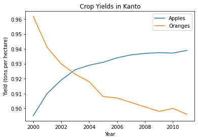


## Line Markers

We can also show markers for the data points on each line using the marker argument of plt.plot. Matplotlib supports many different types of markers like circle, cross, square, diamond etc. You can find the full list of marker types here: https://matplotlib.org/3.1.1/api/markers_api.html

```python
plt.plot(years, apples, marker='o')
plt.plot(years, oranges, marker='x')

plt.xlabel('Year')
plt.ylabel('Yield (tons per hectare)')

plt.title("Crop Yields in Kanto")
plt.legend(['Apples', 'Oranges']);
```

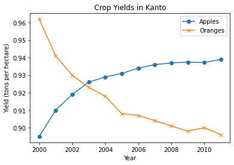


## Styling lines and markers

The plt.plot function supports many arguments for styling lines and markers:

    - color or c: set the color of the line (supported colors)
    - linestyle or ls: choose between a solid or dashed line
    - linewidth or lw: set the width of a line
    - markersize or ms: set the size of markers
    - markeredgecolor or mec: set the edge color for markers
    - markeredgewidth or mew: set the edge width for markers
    - markerfacecolor or mfc: set the fill color for markers
    - alpha: opacity of the plot

Check out the documentation for plt.plot to learn more: https://matplotlib.org/api/_as_gen/matplotlib.pyplot.plot.html#matplotlib.pyplot.plot

```python
plt.plot(years, apples, marker='s', c='b', ls='-', lw=2, ms=8, mew=2, mec='navy', alpha=.5)
plt.plot(years, oranges, marker='o', c='r', ls='--', lw=3, ms=10, alpha=.5)

plt.xlabel('Year')
plt.ylabel('Yield (tons per hectare)')

plt.title("Crop Yields in Kanto")
plt.legend(['Apples', 'Oranges']);
```

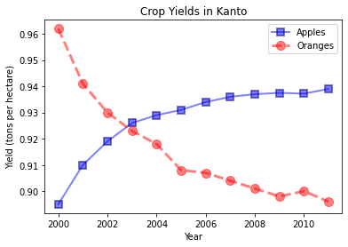

The fmt argument provides a shorthand for specifying the line style, marker and line color. It can be provided as the third argument to plt.plot.

    fmt = '[marker][line][color]'

```python
plt.plot(years, apples, 's-b')
plt.plot(years, oranges, 'o--r')

plt.xlabel('Year')
plt.ylabel('Yield (tons per hectare)')

plt.title("Crop Yields in Kanto")
plt.legend(['Apples', 'Oranges']);
```

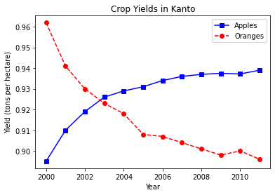

If no line style is specified in fmt, only markers are drawn.

```python
plt.plot(years, oranges, 'or')
plt.title("Yield of Oranges (tons per hectare)");
```

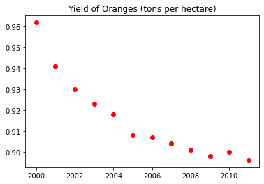

## Changing the Figure Size

You can use the plt.figure function to change the size of the figure.

```python
plt.figure(figsize=(12, 6))

plt.plot(years, oranges, 'or')
plt.title("Yield of Oranges (tons per hectare)");
```


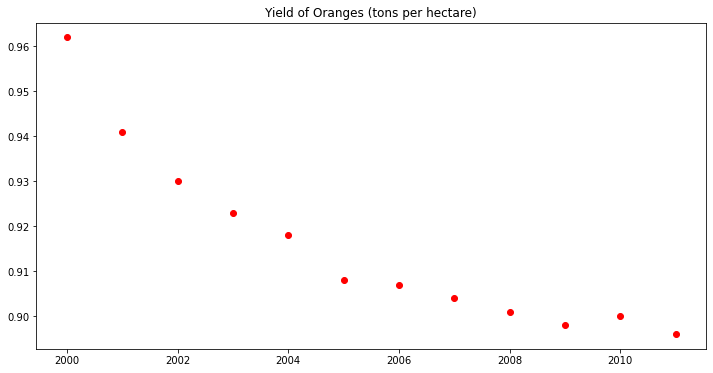


## Improving Default Styles using Seaborn

An easy way to make your charts look beautiful is to use some default styles provided in the Seaborn library. These can be applied globally using the sns.set_style function. You can see a full list of predefined styles here: https://seaborn.pydata.org/generated/seaborn.set_style.html


```python
sns.set_style("whitegrid")
```

```python
plt.plot(years, apples, 's-b')
plt.plot(years, oranges, 'o--r')

plt.xlabel('Year')
plt.ylabel('Yield (tons per hectare)')

plt.title("Crop Yields in Kanto")
plt.legend(['Apples', 'Oranges']);
```

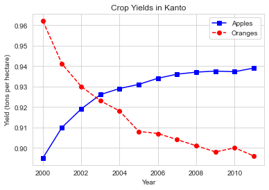

You can also edit default styles directly by modifying the matplotlib.rcParams dictionary. Learn more: https://matplotlib.org/3.2.1/tutorials/introductory/customizing.html#matplotlib-rcparams


```python
import matplotlib
matplotlib.rcParams['font.size'] = 14
matplotlib.rcParams['figure.figsize'] = (9, 5)
matplotlib.rcParams['figure.facecolor'] = '#00000000'
```

```python
sns.set_style("darkgrid")
```

```python
plt.plot(years, apples, 's-b')
plt.plot(years, oranges, 'o--r')

plt.xlabel('Year')
plt.ylabel('Yield (tons per hectare)')

plt.title("Crop Yields in Kanto")
plt.legend(['Apples', 'Oranges']);
```


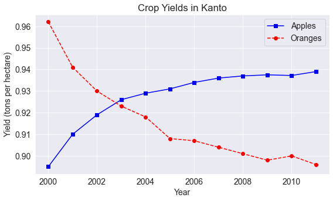


```python
plt.plot(years, oranges, 'or')
plt.title("Yield of Oranges (tons per hectare)");
```


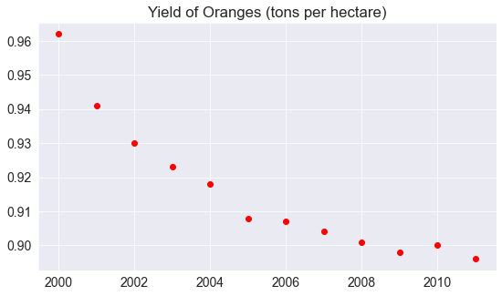


## Scatter Plot

In a scatter plot, the values of 2 variables are plotted as points on a 2-dimensional grid. Additionally, you can also use a third variable to determine the size or color of the points. Let's try out an example.

The Iris flower dataset provides samples measurements of sepals and petals for 3 species of flowers. The Iris dataset is included with the Seaborn library, and can be loaded as a Pandas data frame.

```python
# Load data into a Pandas dataframe
flowers_df = sns.load_dataset("iris")
```

```python
flowers_df
```

<div>
<table border="1" class="dataframe">
  <thead>
    <tr style="text-align: right;">
      <th></th>
      <th>sepal_length</th>
      <th>sepal_width</th>
      <th>petal_length</th>
      <th>petal_width</th>
      <th>species</th>
    </tr>
  </thead>
  <tbody>
    <tr>
      <th>0</th>
      <td>5.1</td>
      <td>3.5</td>
      <td>1.4</td>
      <td>0.2</td>
      <td>setosa</td>
    </tr>
    <tr>
      <th>1</th>
      <td>4.9</td>
      <td>3.0</td>
      <td>1.4</td>
      <td>0.2</td>
      <td>setosa</td>
    </tr>
    <tr>
      <th>2</th>
      <td>4.7</td>
      <td>3.2</td>
      <td>1.3</td>
      <td>0.2</td>
      <td>setosa</td>
    </tr>
    <tr>
      <th>3</th>
      <td>4.6</td>
      <td>3.1</td>
      <td>1.5</td>
      <td>0.2</td>
      <td>setosa</td>
    </tr>
    <tr>
      <th>4</th>
      <td>5.0</td>
      <td>3.6</td>
      <td>1.4</td>
      <td>0.2</td>
      <td>setosa</td>
    </tr>
    <tr>
      <th>...</th>
      <td>...</td>
      <td>...</td>
      <td>...</td>
      <td>...</td>
      <td>...</td>
    </tr>
    <tr>
      <th>145</th>
      <td>6.7</td>
      <td>3.0</td>
      <td>5.2</td>
      <td>2.3</td>
      <td>virginica</td>
    </tr>
    <tr>
      <th>146</th>
      <td>6.3</td>
      <td>2.5</td>
      <td>5.0</td>
      <td>1.9</td>
      <td>virginica</td>
    </tr>
    <tr>
      <th>147</th>
      <td>6.5</td>
      <td>3.0</td>
      <td>5.2</td>
      <td>2.0</td>
      <td>virginica</td>
    </tr>
    <tr>
      <th>148</th>
      <td>6.2</td>
      <td>3.4</td>
      <td>5.4</td>
      <td>2.3</td>
      <td>virginica</td>
    </tr>
    <tr>
      <th>149</th>
      <td>5.9</td>
      <td>3.0</td>
      <td>5.1</td>
      <td>1.8</td>
      <td>virginica</td>
    </tr>
  </tbody>
</table>
<p>150 rows × 5 columns</p>
</div>

```python
flowers_df.species.unique()
```
    array(['setosa', 'versicolor', 'virginica'], dtype=object)

Let's try to visualize the relationship between sepal length and sepal width. Our first instinct might be to create a line chart using plt.plot. However, the output is not very informative as there are too many combinations of the two properties within the dataset, and there doesn't seem to be simple relationship between them.

```python
plt.plot(flowers_df.sepal_length, flowers_df.sepal_width);
```

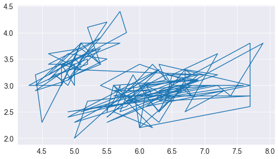

We can use a scatter plot to visualize how sepal length & sepal width vary using the scatterplot function from seaborn (imported as sns).

```python
sns.scatterplot(x = flowers_df.sepal_length, y = flowers_df.sepal_width);
```

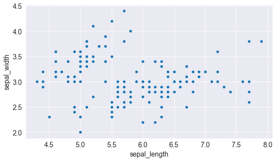


## Adding Hues

Notice how the points in the above plot seem to form distinct clusters with some outliers. We can color the dots using the flower species as a hue. We can also make the points larger using the s argument.

```python
sns.scatterplot(x=flowers_df.sepal_length, y=flowers_df.sepal_width, hue=flowers_df.species, s=80);
```

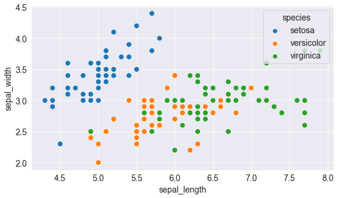

Adding hues makes the plot more informative. We can immediately tell that flowers of the Setosa species have a smaller sepal length but higher sepal widths, while the opposite holds true for the Virginica species.

## Customizing Seaborn Figures

Since Seaborn uses Matplotlib's plotting functions internally, we can use functions like plt.figure and plt.title to modify the figure.

```python
plt.figure(figsize=(12, 6))
plt.title('Sepal Dimensions')

sns.scatterplot(x=flowers_df.sepal_length, 
                y=flowers_df.sepal_width, 
                hue=flowers_df.species,
                s=80);
```

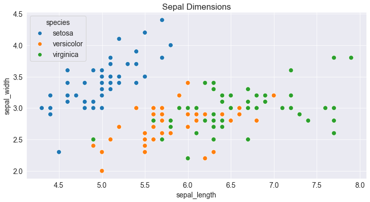

## Plotting using Pandas Data Frames

Seaborn has in-built support for Pandas data frames. Instead of passing each column as a series, you can also pass column names and use the data argument to pass the data frame.

```python
plt.title('Sepal Dimensions')
sns.scatterplot(x='sepal_length', 
                y='sepal_width', 
                hue='species',
                s=80,
                data=flowers_df);
```

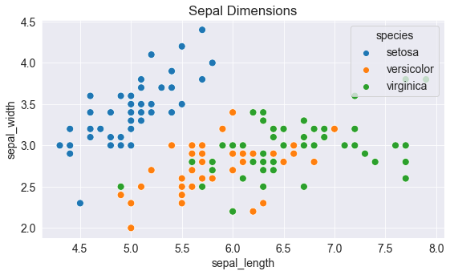

## Histogram

A histogram represents the distribution of data by forming bins along the range of the data and then drawing bars to show the number of observations that fall in each bin.

As an example, let's visualize the how the values of sepal width in the flowers dataset are distributed. We can use the plt.hist function to create a histogram.

```python
# Load data into a Pandas dataframe

flowers_df = sns.load_dataset("iris")
```

```python
flowers_df.sepal_width
```

    0      3.5
    1      3.0
    2      3.2
    3      3.1
    4      3.6
          ... 
    145    3.0
    146    2.5
    147    3.0
    148    3.4
    149    3.0
    Name: sepal_width, Length: 150, dtype: float64

```python
plt.title("Distribution of Sepal Width")
plt.hist(flowers_df.sepal_width);
```

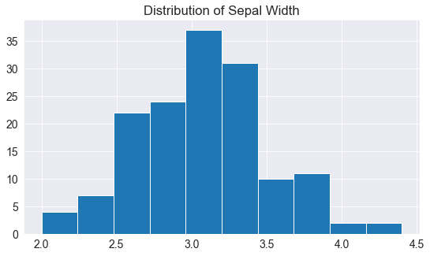

We can immediately see that values of sepal width fall in the range 2.0 - 4.5, and around 35 values are in the range 2.9 - 3.1, which seems to be the largest bin.

## Controlling the size and number of bins

We can control the number of bins, or the size of each bin using the bins argument.

```python
# Specifying the number of bins

plt.hist(flowers_df.sepal_width, bins=5);
```

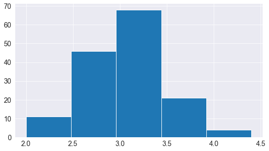

```python
import numpy as np

# Specifying the boundaries of each bin
plt.hist(flowers_df.sepal_width, bins=np.arange(2, 5, 0.25));
```

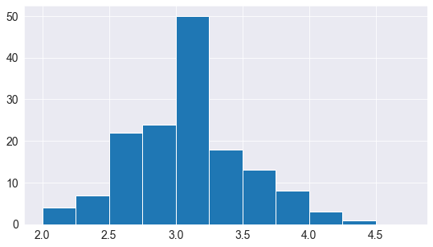

```python
# Bins of unequal sizes
plt.hist(flowers_df.sepal_width, bins=[1, 3, 4, 4.5]);
```

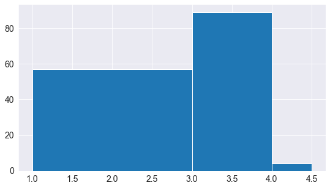

## Multiple Histograms

Similar to line charts, we can draw multiple histograms in a single chart. We can reduce the opacity of each histogram, so the the bars of one histogram don't hide the bars for others.

Let's draw separate histograms for each species of flowers.

```python
setosa_df = flowers_df[flowers_df.species == 'setosa']
```

```python
versicolor_df = flowers_df[flowers_df.species == 'versicolor']
```

```python
virginica_df = flowers_df[flowers_df.species == 'virginica']
```

```python
plt.hist(setosa_df.sepal_width, alpha=0.5, bins=np.arange(2, 5, 0.25));
plt.hist(versicolor_df.sepal_width, alpha=0.5, bins=np.arange(2, 5, 0.25));

plt.legend(['Setosa', 'Versicolor']);
```

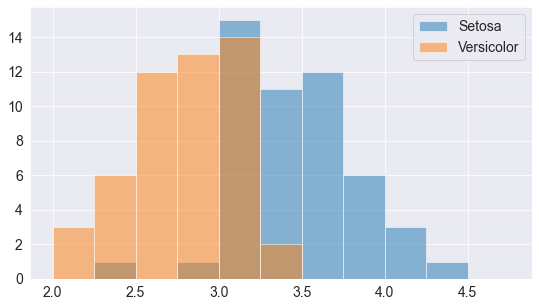

We can also stack multiple histograms on top of one another.

```python
plt.title('Distribution of Sepal Width')

plt.hist([setosa_df.sepal_width, versicolor_df.sepal_width, virginica_df.sepal_width], 
         bins=np.arange(2, 5, 0.25), 
         stacked=True);

plt.legend(['Setosa', 'Versicolor', 'Virginica']);
```

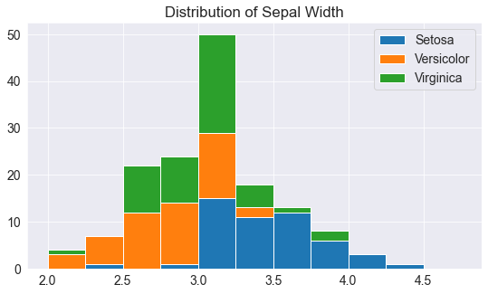

## Bar Chart

Bar charts are quite similar to line charts i.e. they show a sequence of values, however a bar is shown for each value, rather than points connected by lines. We can use the plt.bar function to draw a bar chart.

```python
years = range(2000, 2006)
apples = [0.35, 0.6, 0.9, 0.8, 0.65, 0.8]
oranges = [0.4, 0.8, 0.9, 0.7, 0.6, 0.8]
```

```python
plt.plot(years, apples);
```

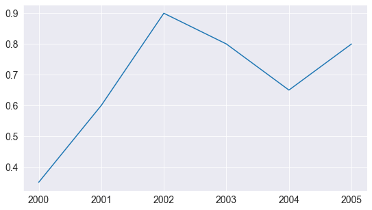

```python
plt.bar(years, apples);
```

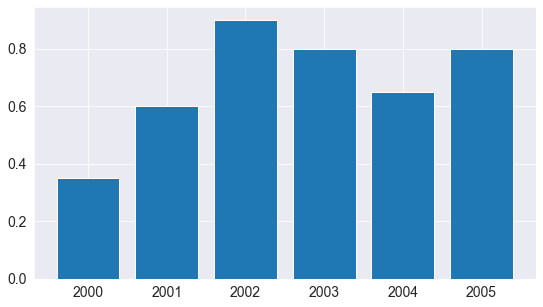


```python
plt.plot(years, oranges);
```

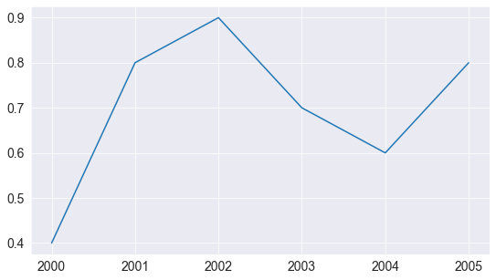

```python
plt.bar(years, oranges);
```


```python
plt.bar(years, oranges);
plt.plot(years, oranges, 'o--r');
```

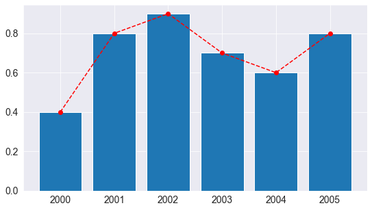

Like histograms, bars can also be stacked on top of one another. We use the bottom argument to plt.bar to achieve this.

```python
plt.bar(years, apples)
plt.bar(years, oranges, bottom=apples);
```

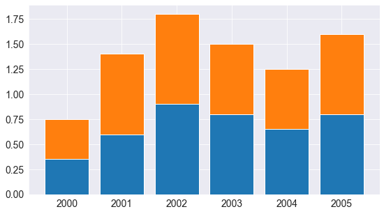

## Bar Plots with Averages

Let's look at another sample dataset included with Seaborn, called "tips". The dataset contains information about the sex, time of day, total bill and tip amount for customers visiting a restaurant over a week.


```python
tips_df = sns.load_dataset("tips");
```

```python
tips_df
```


<div>
<table border="1" class="dataframe">
  <thead>
    <tr style="text-align: right;">
      <th></th>
      <th>total_bill</th>
      <th>tip</th>
      <th>sex</th>
      <th>smoker</th>
      <th>day</th>
      <th>time</th>
      <th>size</th>
    </tr>
  </thead>
  <tbody>
    <tr>
      <th>0</th>
      <td>16.99</td>
      <td>1.01</td>
      <td>Female</td>
      <td>No</td>
      <td>Sun</td>
      <td>Dinner</td>
      <td>2</td>
    </tr>
    <tr>
      <th>1</th>
      <td>10.34</td>
      <td>1.66</td>
      <td>Male</td>
      <td>No</td>
      <td>Sun</td>
      <td>Dinner</td>
      <td>3</td>
    </tr>
    <tr>
      <th>2</th>
      <td>21.01</td>
      <td>3.50</td>
      <td>Male</td>
      <td>No</td>
      <td>Sun</td>
      <td>Dinner</td>
      <td>3</td>
    </tr>
    <tr>
      <th>3</th>
      <td>23.68</td>
      <td>3.31</td>
      <td>Male</td>
      <td>No</td>
      <td>Sun</td>
      <td>Dinner</td>
      <td>2</td>
    </tr>
    <tr>
      <th>4</th>
      <td>24.59</td>
      <td>3.61</td>
      <td>Female</td>
      <td>No</td>
      <td>Sun</td>
      <td>Dinner</td>
      <td>4</td>
    </tr>
    <tr>
      <th>...</th>
      <td>...</td>
      <td>...</td>
      <td>...</td>
      <td>...</td>
      <td>...</td>
      <td>...</td>
      <td>...</td>
    </tr>
    <tr>
      <th>239</th>
      <td>29.03</td>
      <td>5.92</td>
      <td>Male</td>
      <td>No</td>
      <td>Sat</td>
      <td>Dinner</td>
      <td>3</td>
    </tr>
    <tr>
      <th>240</th>
      <td>27.18</td>
      <td>2.00</td>
      <td>Female</td>
      <td>Yes</td>
      <td>Sat</td>
      <td>Dinner</td>
      <td>2</td>
    </tr>
    <tr>
      <th>241</th>
      <td>22.67</td>
      <td>2.00</td>
      <td>Male</td>
      <td>Yes</td>
      <td>Sat</td>
      <td>Dinner</td>
      <td>2</td>
    </tr>
    <tr>
      <th>242</th>
      <td>17.82</td>
      <td>1.75</td>
      <td>Male</td>
      <td>No</td>
      <td>Sat</td>
      <td>Dinner</td>
      <td>2</td>
    </tr>
    <tr>
      <th>243</th>
      <td>18.78</td>
      <td>3.00</td>
      <td>Female</td>
      <td>No</td>
      <td>Thur</td>
      <td>Dinner</td>
      <td>2</td>
    </tr>
  </tbody>
</table>
<p>244 rows × 7 columns</p>
</div>


We might want to draw a bar chart to visualize how the average bill amount varies across different days of the week. One way to do this would be to compute the day-wise averages and then use plt.bar (try it as an exercise).

However, since this is a very common use case, the Seaborn library provides a barplot function which can automatically compute averages.

```python
sns.barplot(x='day', y='total_bill', data=tips_df);
```

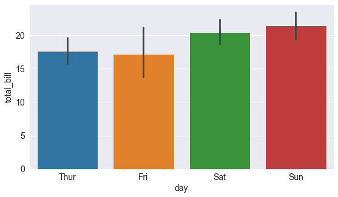

The lines cutting each bar represent the amount of variation in the values. For instance, it seems like the variation in the total bill was quite high on Fridays, and lower on Saturday.

We can also specify a hue argument to compare bar plots side-by-side based on a third feature e.g. sex.


```python
sns.barplot(x='day', y='total_bill', hue='sex', data=tips_df);
```

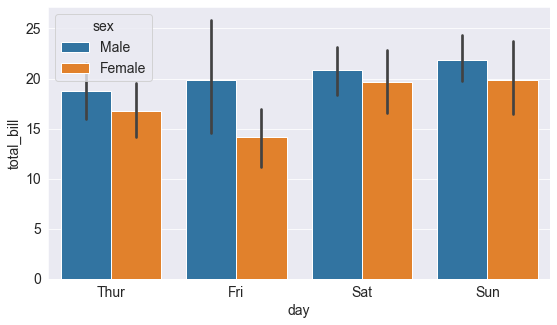

You can make the bars horizontal simply by switching the axes.

```python
sns.barplot(x='total_bill', y='day', hue='sex', data=tips_df);
```

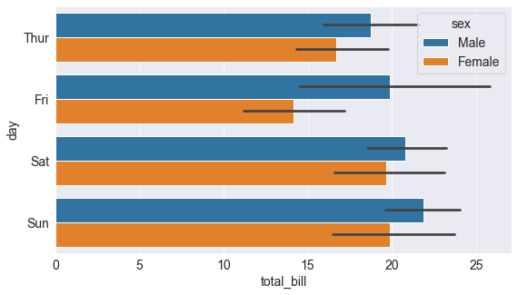

## Heatmap

A heatmap is used to visualize 2-dimensional data like a matrix or a table using colors. The best way to understand it is by looking at an example. We'll use another sample dataset from Seaborn, called "flights", to visualize monthly passenger footfall at an airport over 12 years.

```python
flights = sns.load_dataset("flights")
```

```python
flights
```

<div>
<table border="1" class="dataframe">
  <thead>
    <tr style="text-align: right;">
      <th></th>
      <th>year</th>
      <th>month</th>
      <th>passengers</th>
    </tr>
  </thead>
  <tbody>
    <tr>
      <th>0</th>
      <td>1949</td>
      <td>Jan</td>
      <td>112</td>
    </tr>
    <tr>
      <th>1</th>
      <td>1949</td>
      <td>Feb</td>
      <td>118</td>
    </tr>
    <tr>
      <th>2</th>
      <td>1949</td>
      <td>Mar</td>
      <td>132</td>
    </tr>
    <tr>
      <th>3</th>
      <td>1949</td>
      <td>Apr</td>
      <td>129</td>
    </tr>
    <tr>
      <th>4</th>
      <td>1949</td>
      <td>May</td>
      <td>121</td>
    </tr>
    <tr>
      <th>...</th>
      <td>...</td>
      <td>...</td>
      <td>...</td>
    </tr>
    <tr>
      <th>139</th>
      <td>1960</td>
      <td>Aug</td>
      <td>606</td>
    </tr>
    <tr>
      <th>140</th>
      <td>1960</td>
      <td>Sep</td>
      <td>508</td>
    </tr>
    <tr>
      <th>141</th>
      <td>1960</td>
      <td>Oct</td>
      <td>461</td>
    </tr>
    <tr>
      <th>142</th>
      <td>1960</td>
      <td>Nov</td>
      <td>390</td>
    </tr>
    <tr>
      <th>143</th>
      <td>1960</td>
      <td>Dec</td>
      <td>432</td>
    </tr>
  </tbody>
</table>
<p>144 rows × 3 columns</p>
</div>

```python
flights_df = flights.pivot("month", "year", "passengers")
```

```python
flights_df
```

<div>
<table border="1" class="dataframe">
  <thead>
    <tr style="text-align: right;">
      <th>year</th>
      <th>1949</th>
      <th>1950</th>
      <th>1951</th>
      <th>1952</th>
      <th>1953</th>
      <th>1954</th>
      <th>1955</th>
      <th>1956</th>
      <th>1957</th>
      <th>1958</th>
      <th>1959</th>
      <th>1960</th>
    </tr>
    <tr>
      <th>month</th>
      <th></th>
      <th></th>
      <th></th>
      <th></th>
      <th></th>
      <th></th>
      <th></th>
      <th></th>
      <th></th>
      <th></th>
      <th></th>
      <th></th>
    </tr>
  </thead>
  <tbody>
    <tr>
      <th>Jan</th>
      <td>112</td>
      <td>115</td>
      <td>145</td>
      <td>171</td>
      <td>196</td>
      <td>204</td>
      <td>242</td>
      <td>284</td>
      <td>315</td>
      <td>340</td>
      <td>360</td>
      <td>417</td>
    </tr>
    <tr>
      <th>Feb</th>
      <td>118</td>
      <td>126</td>
      <td>150</td>
      <td>180</td>
      <td>196</td>
      <td>188</td>
      <td>233</td>
      <td>277</td>
      <td>301</td>
      <td>318</td>
      <td>342</td>
      <td>391</td>
    </tr>
    <tr>
      <th>Mar</th>
      <td>132</td>
      <td>141</td>
      <td>178</td>
      <td>193</td>
      <td>236</td>
      <td>235</td>
      <td>267</td>
      <td>317</td>
      <td>356</td>
      <td>362</td>
      <td>406</td>
      <td>419</td>
    </tr>
    <tr>
      <th>Apr</th>
      <td>129</td>
      <td>135</td>
      <td>163</td>
      <td>181</td>
      <td>235</td>
      <td>227</td>
      <td>269</td>
      <td>313</td>
      <td>348</td>
      <td>348</td>
      <td>396</td>
      <td>461</td>
    </tr>
    <tr>
      <th>May</th>
      <td>121</td>
      <td>125</td>
      <td>172</td>
      <td>183</td>
      <td>229</td>
      <td>234</td>
      <td>270</td>
      <td>318</td>
      <td>355</td>
      <td>363</td>
      <td>420</td>
      <td>472</td>
    </tr>
    <tr>
      <th>Jun</th>
      <td>135</td>
      <td>149</td>
      <td>178</td>
      <td>218</td>
      <td>243</td>
      <td>264</td>
      <td>315</td>
      <td>374</td>
      <td>422</td>
      <td>435</td>
      <td>472</td>
      <td>535</td>
    </tr>
    <tr>
      <th>Jul</th>
      <td>148</td>
      <td>170</td>
      <td>199</td>
      <td>230</td>
      <td>264</td>
      <td>302</td>
      <td>364</td>
      <td>413</td>
      <td>465</td>
      <td>491</td>
      <td>548</td>
      <td>622</td>
    </tr>
    <tr>
      <th>Aug</th>
      <td>148</td>
      <td>170</td>
      <td>199</td>
      <td>242</td>
      <td>272</td>
      <td>293</td>
      <td>347</td>
      <td>405</td>
      <td>467</td>
      <td>505</td>
      <td>559</td>
      <td>606</td>
    </tr>
    <tr>
      <th>Sep</th>
      <td>136</td>
      <td>158</td>
      <td>184</td>
      <td>209</td>
      <td>237</td>
      <td>259</td>
      <td>312</td>
      <td>355</td>
      <td>404</td>
      <td>404</td>
      <td>463</td>
      <td>508</td>
    </tr>
    <tr>
      <th>Oct</th>
      <td>119</td>
      <td>133</td>
      <td>162</td>
      <td>191</td>
      <td>211</td>
      <td>229</td>
      <td>274</td>
      <td>306</td>
      <td>347</td>
      <td>359</td>
      <td>407</td>
      <td>461</td>
    </tr>
    <tr>
      <th>Nov</th>
      <td>104</td>
      <td>114</td>
      <td>146</td>
      <td>172</td>
      <td>180</td>
      <td>203</td>
      <td>237</td>
      <td>271</td>
      <td>305</td>
      <td>310</td>
      <td>362</td>
      <td>390</td>
    </tr>
    <tr>
      <th>Dec</th>
      <td>118</td>
      <td>140</td>
      <td>166</td>
      <td>194</td>
      <td>201</td>
      <td>229</td>
      <td>278</td>
      <td>306</td>
      <td>336</td>
      <td>337</td>
      <td>405</td>
      <td>432</td>
    </tr>
  </tbody>
</table>
</div>


flights_df is a matrix with one row for each month and one column of each year. The values in the matrix show the number of passengers (in thousands) that visited the airport in a specific month of a specific year. We can use the sns.heatmap function to visualize the footfall at the airport.

```python
plt.figure(figsize=(15, 6))
plt.title("No. of Passengers in thousands")
sns.heatmap(flights_df);
```

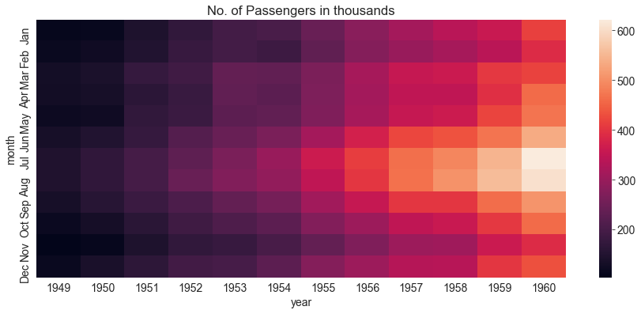

The brighter colors indicate a higher footfall at the airport. By looking at the graph, we can infer two things:

    - The footfall at the airport in any given year tends to be the highest around July & August.
    - The footfall at the airport in any given month tends to grow year by year.
    
We can use the cmap argument to change the color palette.

```python
plt.figure(figsize=(15, 6))
plt.title("No. of Passengers (1000s)")
sns.heatmap(flights_df, cmap='Blues');
```

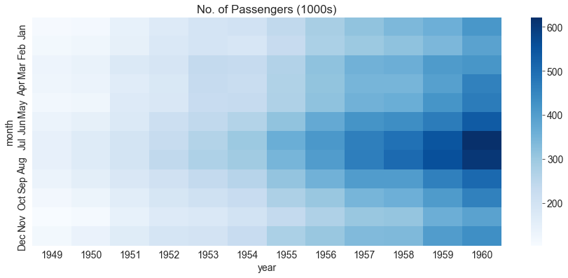

We can also display the actual values in each block by specifying annot=True.

```python
plt.figure(figsize=(15, 6))
plt.title("No. of Passengers (1000s)")
sns.heatmap(flights_df, fmt="d", annot=True, cmap='Blues');
```

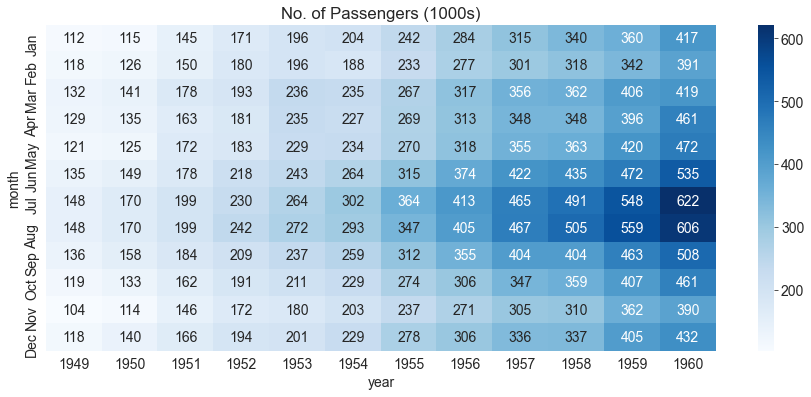

## Images

Matplotlib can also be used to display images. Let's download an image from the internet.

```python
from urllib.request import urlretrieve
```

```python
urlretrieve('https://i.imgur.com/SkPbq.jpg', 'chart.jpg');
```

Before an image can be displayed, it has to be read into memory using the PIL module

```python
from PIL import Image
```

```python
img = Image.open('chart.jpg')
```

An image loaded using PIL is simply a 3-dimensional numpy array containing pixel intensities for the red, green & blue (RGB) channels of the image. We can convert the image into an array using np.array.

```python
img_array = np.array(img)
```

```python
img_array.shape
```

    (481, 640, 3)

We can display the PIL image using plt.imshow.

```python
plt.imshow(img);
```

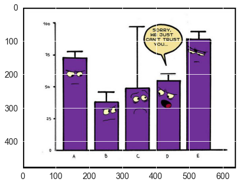

We can turn off the axes & grid lines, and show a title using the relevant functions.

```python
plt.grid(False)
plt.axis('off')

plt.title('A data science meme')
plt.imshow(img);
```

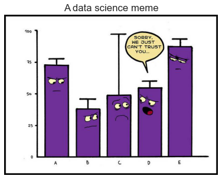

To display a part of the image, we can simply select a slice from the numpy array.

```python
plt.grid(False)
plt.axis('off')
plt.imshow(img_array[125:325,105:305]);
```


## Plotting multiple charts in a grid

Matplotlib and Seaborn also support plotting multiple charts in a grid, using plt.subplots, which returns a set of axes that can be used for plotting.
Here's a single grid showing the different types of charts we've covered in this tutorial.


```python
fig, axes = plt.subplots(2, 3, figsize=(16, 10))

#---------------------------------------------------------------------------------------------------------------------------

# Use the axes for plotting - line chart
axes[0,0].plot(years, apples, 's-b')
axes[0,0].plot(years, oranges, 'o--r')
axes[0,0].set_xlabel('Year')
axes[0,0].set_ylabel('Yield (tons per hectare)')
axes[0,0].legend(['Apples', 'Oranges']);
axes[0,0].set_title('Crop Yields in Kanto')

#---------------------------------------------------------------------------------------------------------------------------

# Pass the axes into seaborn - scatterplot
axes[0,1].set_title('Sepal Length vs. Sepal Width')
sns.scatterplot(x=flowers_df.sepal_length, 
                y=flowers_df.sepal_width, 
                hue=flowers_df.species, 
                s=80, 
                ax=axes[0,1]);

#---------------------------------------------------------------------------------------------------------------------------

# Use the axes for plotting - histogram
axes[0,2].set_title('Distribution of Sepal Width')
axes[0,2].hist([setosa_df.sepal_width, versicolor_df.sepal_width, virginica_df.sepal_width], 
         bins=np.arange(2, 5, 0.25), 
         stacked=True);

axes[0,2].legend(['Setosa', 'Versicolor', 'Virginica']);

#---------------------------------------------------------------------------------------------------------------------------

# Pass the axes into seaborn - bar chart
axes[1,0].set_title('Restaurant bills')
sns.barplot(x='day', y='total_bill', hue='sex', data=tips_df, ax=axes[1,0]);

#---------------------------------------------------------------------------------------------------------------------------

# Pass the axes into seaborn - heatmap
axes[1,1].set_title('Flight traffic')
sns.heatmap(flights_df, cmap='Blues', ax=axes[1,1]);

#---------------------------------------------------------------------------------------------------------------------------

# Plot an image using the axes - image
axes[1,2].set_title('Data Science Meme')
axes[1,2].imshow(img)
axes[1,2].grid(False)
axes[1,2].set_xticks([])
axes[1,2].set_yticks([])

#---------------------------------------------------------------------------------------------------------------------------

plt.tight_layout(pad=2);
```

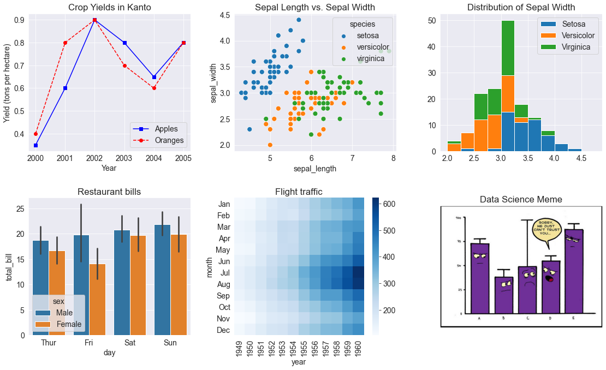

See this page for a full list of supported functions: https://matplotlib.org/3.3.1/api/axes_api.html#the-axes-class.

## Pair plots with Seaborn

Seaborn also provides a helper function sns.pairplot to automatically plot different types of charts for pairs of features within a dataframe.

```python
sns.pairplot(flowers_df, hue='species');
```

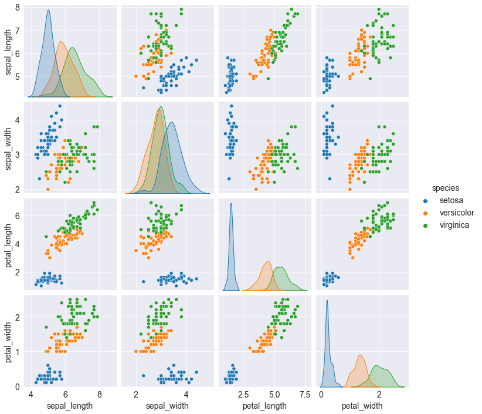

```python
sns.pairplot(tips_df, hue='sex');
```

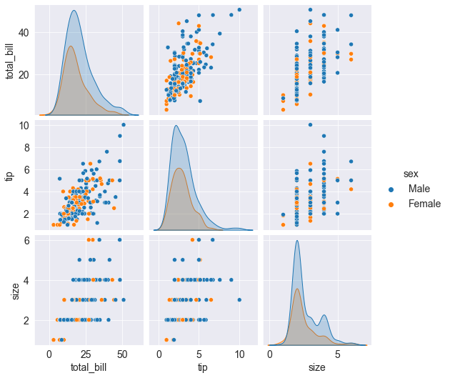
